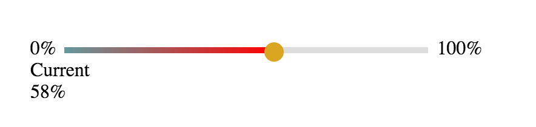

# range.js
range.js beautiful slide bar for &lt;input type=range /&gt; . Now, chrome, safari, firefox browser are supported.

## Basic
Basic style as follows:

## Usage
More detail usage visit [http://rangejs.doukit.org/](http://rangejs.doukit.org/).

## Dependency
[jQuery](https://jquery.com/)

## Browser Support
Chrome, Safari, Firefox

## License 
range.js is freely distributable under the terms of the [MIT license](./LICENSE).

## Date
2015-11-13
