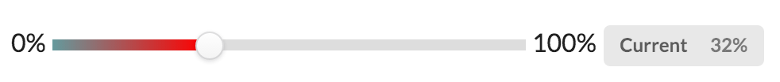
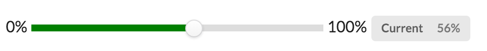

# range.js
A beautiful input slider (jQuery plugin) for HTML5 &lt;input type='range'&gt;. Now, chrome, safari, firefox, opera browser are supported.

## Usage
Different input can be configured with different background colors and styles.
```javascript
$('#gradient').range(options);
```
Example:
```javascript
$('#gradient').range({color : 'red', style : 'gradient'});
```
More detail usage visit [http://rangejs.doukit.org/](http://rangejs.doukit.org/).

## Range input style
1. Gradient style (default):

```javascript
   $('#gradient').range({
        color : 'red',
        style : 'gradient'
    });
```
2. Basic style:

```javascript
  $('#basic').range({
        color : 'green',
        style : 'basic'
    });
```

## Dependency
[jQuery](https://jquery.com/)

## Browser Support
Chrome, Safari, Firefox, Opera

## License 
range.js is freely distributable under the terms of the [MIT license](./LICENSE).

## Create Date
2015-11-13

## Update
2015-11-21